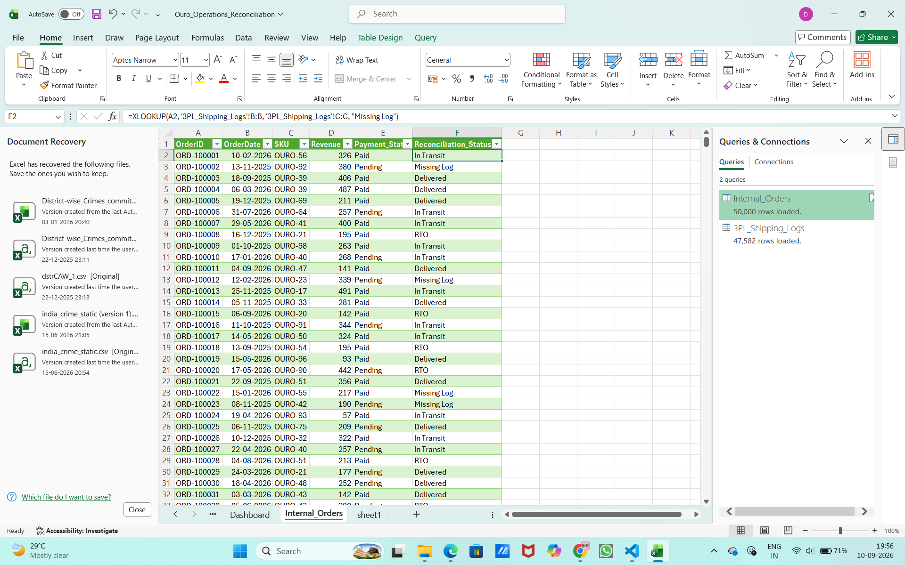

# E-Commerce Operations & Data Reconciliation Dashboard

### Project Overview
Designed and executed an automated MIS reporting dashboard for an independent online jewelry brand, ouro. This project simulates the reconciliation of internal sales data against third-party logistics (3PL) shipping logs to identify operational bottlenecks and missing shipments.

### Skills & Tools Demonstrated
* **Big Data Management:** Processed and validated large datasets (50,000+ records).
* **Data Reconciliation:** Cross-referenced internal orders with external logistics data to ensure record accuracy and consistency.
* **Advanced Excel:** Utilized XLOOKUP for complex data merging and error handling.
* **MIS Reporting:** Built interactive Pivot Tables and PivotCharts to summarize daily fulfillment metrics.
* **System Automation:** Wrote a Python script (`generate_data.py`) to simulate database extraction and automate raw data generation.

### Methodology
1. **Data Extraction:** Generated 50,000 rows of relational operational data simulating a high-volume e-commerce environment.
2. **Record Cleaning:** Applied advanced Excel formulas to merge datasets and flag missing logs or status discrepancies. 
3. **Dashboarding:** Aggregated the cleaned data into a dynamic operations dashboard to provide leadership with instant visibility into fulfillment success rates.

### Visual Proof

![Final Dashboard]Screenshot 2026-09-10 195716.png)
